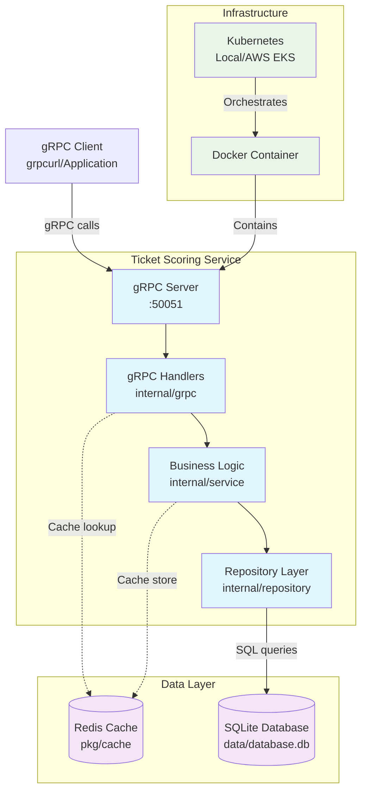

# Zendesk Test Task - Ticket Scoring Service

gRPC service for calculating ticket quality scores based on rating categories with configurable weights. Built with Go and uses the provided SQLite database.

## Task Implementation

This service implements all required functionality from the Klaus test task:

1. **Ticket scoring algorithm** - Accounts for category weights, converts 0-5 ratings to 0-100% scores
2. **Aggregated category scores** - Daily/weekly aggregates over time periods  
3. **Scores by ticket** - Category scores grouped by ticket ID
4. **Overall quality score** - Total aggregate score for a period
5. **Period over period change** - Comparison between time periods

## gRPC Service Methods

- `GetAggregatedCategoryScores` - Returns category scores with time breakdowns
- `GetScoresByTicket` - Returns scores grouped by ticket within a period  
- `GetOverallQualityScore` - Returns overall aggregate score for a period
- `GetPeriodOverPeriodScoreChange` - Returns score change vs previous period

## System Architecture



## System Requirements

- Go 1.24+
- Docker & Docker Compose  
- protoc (Protocol Buffers compiler)
- grpcurl for testing
- minikube (for Local Kubernetes deployment)


```bash
# macOS setup
brew install protobuf grpcurl
go install google.golang.org/protobuf/cmd/protoc-gen-go@latest
go install google.golang.org/grpc/cmd/protoc-gen-go-grpc@latest
```

## Running the Service

```bash
# Build and run with Docker Compose
make run-detached

# Or run interactively  
make run

# Stop service
make stop
```

The service will be available on `localhost:50051`.

## Testing the API

```bash
# List services
grpcurl -plaintext localhost:50051 list

# Overall quality score 
grpcurl -plaintext \
  -d '{"start_date": "2019-01-01T00:00:00Z", "end_date": "2019-12-31T00:00:00Z"}' \
  localhost:50051 ticketscoring.v1.TicketScoring/GetOverallQualityScore

# Category scores over time
grpcurl -plaintext \
  -d '{"start_date": "2019-01-01T00:00:00Z", "end_date": "2019-03-31T00:00:00Z"}' \
  localhost:50051 ticketscoring.v1.TicketScoring/GetAggregatedCategoryScores

# Scores by ticket
grpcurl -plaintext \
  -d '{"start_date": "2019-01-01T00:00:00Z", "end_date": "2019-12-31T00:00:00Z"}' \
  localhost:50051 ticketscoring.v1.TicketScoring/GetScoresByTicket

# Period over period change
grpcurl -plaintext \
  -d '{"start_date": "2019-02-01T00:00:00Z", "end_date": "2019-02-28T00:00:00Z"}' \
  localhost:50051 ticketscoring.v1.TicketScoring/GetPeriodOverPeriodScoreChange
```

## Running Tests

```bash
make test      # Unit and integration tests
make test-all  # Includes E2E tests
```

## Algorithm Implementation

The scoring algorithm converts ratings (0-5 scale) to percentages (0-100%) using category weights from the database:

```
Score = (rating * 20 * weight) / total_weight
```

Categories include Spelling, Grammar, and GDPR compliance with different weights. For periods longer than one month, the service automatically returns weekly aggregates instead of daily values.

## Project Structure  

```
├── api/v1/                 # gRPC protobuf definitions
├── cmd/server/             # Application entry point
├── internal/
│   ├── models/            # Data models  
│   ├── repository/        # Database layer
│   ├── service/          # Business logic
│   ├── grpc/             # gRPC handlers
│   └── config/           # Configuration management
├── pkg/
│   ├── cache/            # Redis cache implementation
│   ├── database/         # Database connection utilities
│   └── grpc/server/      # gRPC server builder
├── data/                 # SQLite database
├── tests/e2e/            # End-to-end tests
├── k8s/                  # Kubernetes manifests
│   ├── local/           # Local/Minikube deployment
│   └── prod/            # Production AWS EKS deployment
└── scripts/              # Build and deployment scripts
```

## Build & Deployment

The solution uses Docker containers and can be deployed to Kubernetes:

```bash
# Docker Compose (simple)
make run-detached

# Kubernetes with Minikube (local)
minikube start
make deploy                  # Deploy to local cluster

# Kubernetes (production-like)  
make deploy
```

Includes health checks, resource limits, and Redis caching for performance. For Minikube deployment, the service will be available through port-forwarding or NodePort services.

## Production Deployment (AWS EKS)

The `k8s/prod/` folder contains production-ready manifests for AWS EKS deployment via GitHub Actions:

### Prerequisites
1. **AWS Setup**: EKS cluster with appropriate node groups and IAM roles
2. **GitHub Secrets**: Configure repository secrets for AWS credentials
   - `AWS_ACCESS_KEY_ID`
   - `AWS_SECRET_ACCESS_KEY`
   - `AWS_REGION`
   - `EKS_CLUSTER_NAME`
3. **Container Registry**: ECR repository for storing Docker images
4. **Database**: RDS or managed database service (replace SQLite in production)

### GitHub Actions Workflow
The deployment would typically involve:
```yaml
- Build and push Docker image to ECR
- Update Kubernetes manifests with new image tag  
- Deploy to EKS using kubectl or Helm
- Run health checks and rollback if needed
```

### Production Considerations
- **Database**: Replace SQLite with RDS PostgreSQL or MySQL
- **Redis**: Use AWS ElastiCache for Redis clustering
- **Monitoring**: CloudWatch integration for logs and metrics
- **Security**: Network policies, secrets management with AWS Secrets Manager
- **Scaling**: Horizontal Pod Autoscaler based on CPU/memory metrics

The production manifests include resource limits, liveness/readiness probes, and are configured for a multi-AZ deployment pattern.

## Notes

- Uses the provided `database.db` file with 2019 sample data
- All date examples use 2019 ranges to match available data  
- Service supports both daily and weekly aggregation based on period length
- Includes comprehensive test coverage (unit, integration, E2E)
